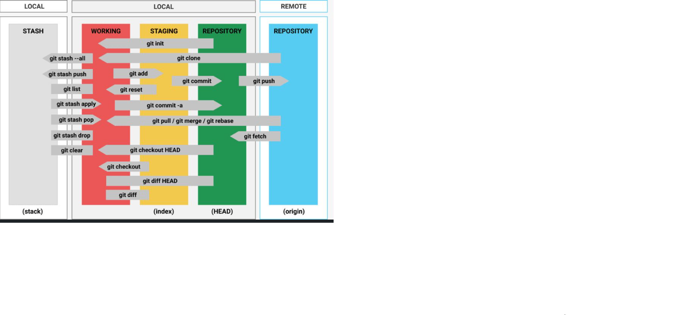

# Este é o Curso de GIT

**Curso de Git & GitHub** voltado para o aprendizado das funcionalidades do Versionamento de Código

## Finalidade

1. **Fundamentos de GIT**
2. **Trabalhando com Branches**
3. **Compartilhamento e Atuailizaçao de Repositórios**
4. **Fundamentos do GitHub**
5. **Técnicas de Markdown do básico ao avançado**
6. **Portófio com GitHub Pages**

## Comandos Fundamentais

*git init* - cria o arquivo .git em um diretório local, tornando ele um diretório com git iniciado;

*git remote add origin <url>* - conecta um repositório remoto ao seu diretório git local;

*git clone <url>* - realiza o clone de um repositório git, trazendo ele para sua máquina já com o git iniciado. (Obs.: é necessário entrar na pasta após realizar o clone);

*git status* - verifica o status dos arquivos na branch atual;

*git add <arquivo>* - adiciona o arquivo ao stage;

*git add .* - adiciona todos os arquivos ao stage. (Obs.: O ponto é importante!);

*git commit* - realiza o commit dos arquios em stage. (Obs.: abre o editor de texto padrão do sistema);

*git commit -m "sua mensagem de commit"* - realiza o commit dos arquivos em stage, adicionando a mensagem que foi adicionada ao fim. (Obs.: não abre o editor de texto);

*git push* - envia os arquivos commitados para o repositório remoto;

*git push -u origin nome_da_branch* - envia arquivos em uma branch que ainda não existe no repositório remoto;

*git pull* - recebe as alterações da branch principal no sue repositório remoto;

*git branch* - lista todas as branchs na sua máquina;

*git branch -a* - lista todas as branchs, incluindo as branches remotas ainda não utilizadas na sua máquina;

*git checkout nome_da_branch* - sai da branch atual e vai para uma branch já existente;

*git checkout -b nova_branch* - sai da branch atual, cria a nova branch e entra nela;

*git fetch* - recebe todas as branchs existentes no repositório remoto;

## Referências

